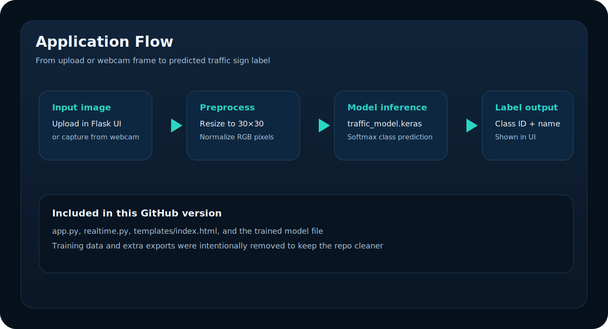

# Traffic Sign Recognition System

A deep learning based Traffic Sign Recognition project with a compact Flask app and realtime webcam inference.


## Dataset and model context

This work is based on the German Traffic Sign Recognition Benchmark dataset and uses a CNN approach for 43-class classification.

Reference samples:


## What is included in this cleaned repo

- app.py for the Flask web app
- realtime.py for webcam based live detection
- traffic_model.keras for inference
- templates/index.html for the frontend
- assets/banner.svg and assets/flow.svg for README visuals

## Preview



## Run locally

1. Create and activate a Python environment.
2. Install packages:

```bash
pip install flask tensorflow opencv-python numpy
```

3. Start the web app:

```bash
python app.py
```

4. Open the local URL shown in the terminal.

## Realtime mode

```bash
python realtime.py
```

Press q to exit the camera window.

## Notes

- This GitHub version is intentionally trimmed to runtime files.
- Training data and extra model exports were removed from this copy.
